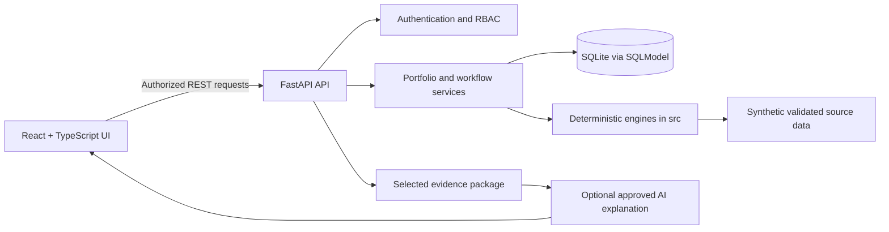

# EPOS Technical Reference

AI-generated decision-support draft; human review required.

This is the consolidated technical README for EPOS (Engineering Portfolio Operating System).
It describes what the application does, how it was built, and every page, tab and function it
provides. Setup and run instructions are intentionally not repeated here; see
[README.md](README.md) for those. Supporting design and methodology records remain in [docs](docs).

## What EPOS Does

EPOS answers three questions that are normally scattered across separate engineering tools:

1. **What needs attention?** It scores every project, ranks the weakest and raises early-warning
   alerts from recorded facts.
2. **Can the answer be trusted?** It separately scores data confidence, exposing stale, incomplete
   and unowned records instead of hiding them behind a single number.
3. **What would a change affect?** It models dependency delays and change requests against recorded
   plans without altering any stored record.

It does this over projects, tasks, milestones, dependencies, risks, issues, assumptions,
requirements, test cases, trace links, change requests, decisions, gates, meetings, resources,
actions and an append-only activity trail.

Concretely, the application:

- **Calculates** portfolio and project Health and Confidence scores, bands, factor breakdowns and
  weighted contributions, always citing the source record IDs behind each result.
- **Detects** eight classes of delivery risk automatically and orders them by severity.
- **Traces** requirements to test cases and verification evidence, exposing exactly what is unproven.
- **Simulates** a dependency slip and reports the resulting completion-date movement and score
  changes across affected projects, plus a sensitivity curve at seven delay sizes.
- **Governs** changes, decisions, gates and meeting outcomes with permissions, optimistic
  concurrency and an audit trail.
- **Explains** results in natural language, but only from a validated evidence package, always
  labelled and never as an authoritative calculation.

> Deterministic Python calculates facts. AI explains selected evidence. Humans approve decisions.

It is not a replacement for enterprise planning, requirements, test-management or ERP systems. It
does not connect to real customer, employee or employer data in this prototype.

## How It Was Made

### Does it use JavaScript?

**Yes.** The user interface is a **React 18** application written in **TypeScript**, which compiles
to JavaScript and runs in the browser. The shipped build contains JavaScript bundles such as
`index-*.js`, `react-*.js` and `charts-*.js`.

The frontend uses the standard Node.js toolchain: npm installs the locked dependencies, TypeScript
compiles, ESLint lints, Vite produces the production build and Vitest runs the test suite. The
compiled build in `frontend/dist` is then served by the Python API. The project is therefore a
**Python backend plus a compiled TypeScript/JavaScript frontend**, not a Python-only application.

### Stack

| Area | Technology | Purpose |
| --- | --- | --- |
| Language | Python 3.11+ | Deterministic engines, API, migrations and tests. |
| API | FastAPI, Pydantic v2 | Typed REST API and request/response validation. |
| Persistence | SQLModel, SQLite, Alembic | Governed local records and schema migration history. |
| Data processing | Pandas | Validated synthetic CSV ingestion for legacy engine inputs. |
| Authentication | PyJWT, Argon2 | Token sessions and password hashing; backend permission enforcement. |
| Frontend | React 18, TypeScript (strict), React Router | Active product interface, compiled to browser JavaScript. |
| Client data | TanStack React Query | API server-state, cache invalidation and mutation coordination. |
| UI | Tailwind CSS, semantic CSS tokens, Lucide | Responsive UI, accessible controls and consistent visual language. |
| Analytics | Recharts | Evidence-led charts with table alternatives. |
| Build / test | Vite, Vitest, Testing Library, JSDOM | Frontend build and regression tests. |
| Python quality | pytest, Ruff, Black | Engine/API checks, formatting and linting. |
| Legacy UI | Streamlit, Plotly | Retained EPOS Lite presentation layer over the same engines. |
| Frontend toolchain | Node.js 20, npm | Locked dependency install, typecheck, lint, build and tests. |

The API also serves the verified frontend build, so the whole product runs from one local origin.

## Architecture



### Layer Responsibilities

- `src/`: authoritative deterministic Health, Confidence, Risk, Change Impact and Scenario logic.
  Scoring weights, bands and thresholds live here, not in the browser.
- `api/`: adapts persisted records into engine inputs and API responses. It owns authentication,
  authorization, project scope, row-version concurrency and audit trails.
- `frontend/src/`: renders API responses and handles presentation, navigation, controlled input and
  accessible interactions. It does not reimplement scoring or risk calculation.
- `data/`: synthetic starter data only. CSV loading is validated before engine use.
- `alembic/` and `migrations/`: schema history; current verified head is `20260316_0014`.
- `docs/`: methodology, architecture, design, security, roadmap and user documentation.

### Main Application Flow

1. A signed-in user requests an authorized view.
2. FastAPI applies role and resource-level scope before returning records.
3. Services pass permitted records to deterministic engines where calculation is required.
4. The API returns calculated facts with supporting record references.
5. React renders facts, filters and accessible chart/table views.
6. Optional AI receives selected, validated evidence and returns a labelled decision-support draft.
   It cannot write data or calculate authoritative scores.

## What It Calculates

Five deterministic engines in `src/` produce every number in the product. Each takes an explicit
`as_of_date`, treats input as read-only and returns the source record IDs behind its result.

### Project Health — seven weighted factors

| Factor | Weight | What it measures |
| --- | --- | --- |
| Schedule Health | 25% | Forecast slip against the baseline end date, in calendar days. |
| Milestone Readiness | 20% | Milestone slip and status, penalised by criticality. |
| Task Delivery | 15% | Blocked, overdue and low-completion tasks. |
| Risk Management | 15% | Open risk exposure, unowned risks and unstarted mitigation. |
| Dependency Health | 10% | Dependency delay days, blocked and at-risk dependencies. |
| Team Capacity | 10% | Resource utilisation above threshold bands. |
| Action Follow-Through | 5% | Overdue actions by priority and missing action owners. |

Each factor starts at 100 and is reduced by documented penalties, then combined into a 0–100 score
banded as **Green ≥ 80**, **Amber ≥ 60**, otherwise **Red**. The engine also returns per-factor
explanations and severity-ordered critical drivers.

### Data Confidence — four weighted factors

| Factor | Weight | What it measures |
| --- | --- | --- |
| Reporting Freshness | 40% | Age of status updates against fresh and stale day thresholds. |
| Information Completeness | 30% | Missing required fields on active records. |
| Accountability Coverage | 20% | Records with no assigned owner. |
| Data Availability | 10% | Prototype source-availability assessment. |

Bands are **High ≥ 80**, **Medium ≥ 60**, otherwise **Low**. Confidence is deliberately separate from
Health, so a good-looking score built on stale data stays visible instead of being implied.

### Early-Warning Risk Engine — eight rules

Alerts are generated with stable IDs, deduplicated and ordered by severity:

1. Unowned high-exposure risk.
2. Critical milestone forecast slip.
3. Milestone delayed by a dependency.
4. Blocked task feeding a critical milestone.
5. Overdue high-priority action.
6. Resource over-allocation.
7. Stale project status reporting.
8. Requirement missing verification evidence.

### Change Impact Engine

For one change request it identifies affected requirements, tasks, milestones and test cases,
derives the highest affected criticality, assigns a change risk level and returns a coarse schedule
estimate in calendar days. This is a documented heuristic lookup, not a forecast.

### Scenario Engine

Models an additional delay on a recorded dependency and propagates it through the dependency network
to produce new completion dates, per-factor score deltas, weighted contributions, band changes,
alert differences and affected schedule movements — without writing to any record.

## Pages, Tabs and Functions

Navigation is grouped into **Analysis**, **Execution**, **Governance**, **Engineering** and
**Administration**, filtered by the signed-in role. The API remains the enforcement boundary.

### Analysis

| Page | Route | Functions |
| --- | --- | --- |
| Executive summary | `/` | Portfolio KPI tiles linking to filtered views; calculated position briefing; health and confidence distributions; engine-ranked attention list; weakest-project panel; pending decisions; recent activity. |
| Portfolio | `/portfolio` | Filters for project, health band, confidence band, manager, domain, phase, priority, alert severity and forecast date range; shareable URL state; text search; cross-filtering by clicking chart segments, bars, scatter points or KPI tiles; ranked project register; alert list with source disambiguation; methodology note. |
| Risks | `/risks` | Portfolio-wide risk register with optional project scope; selectable 5×5 probability/impact matrix; status and search filters; unowned-risk count; risk detail drawer with source evidence. |
| Executive report | `/report` | Deterministic reporting-window selection, cited statements, copy to clipboard with failure recovery and a print-oriented layout. |
| Scenarios | `/scenarios` | Dependency selector with search; integer delay input (1–365) plus presets; calculated outcome panel; baseline/scenario timeline; dependency hand-off detail; factor waterfall and weighted-contribution chart; seven-point sensitivity curve with threshold explanations; affected-record movement table; assumptions and limitations; optional AI explanation. |
| Ask EPOS | `/ask` | Free-text questions; per-turn portfolio or project scope; conversation history; suggested starters; evidence drawer; retry of failed questions; clear conversation; distinct labels for calculated lookups and AI explanations. |

### Execution

| Page | Route | Functions |
| --- | --- | --- |
| My Work | `/my-work` | Tasks assigned to the signed-in user identity across authorized projects, with all, blocked, overdue and upcoming views plus a project filter. |
| Calendar | `/calendar` | Month grid and mobile agenda over milestone forecasts, task forecasts, risk due dates and change-raised dates; kind filters; month defaults to the analysis date. |
| Projects | `/projects` | Three views on one route: project register, blocked items and action tracker, with project filter and owner, milestone, status, forecast and last-update context. |
| New project | `/projects/new` | Guided four-step creation with reference suggestion, validation, review step, optional first milestone and initial risk, and explicit partial-failure reporting. |

### Project workspace — `/projects/:projectId`

Twelve tabs cover one project end to end:

| Tab | Functions |
| --- | --- |
| Overview | Actionable position strip (health, confidence, risk factor, next milestone, alerts, blocked work, requirements and testing, actions); source-backed attention; gate readiness; data-quality correction panel; what-changed panel; project record disclosure. |
| Delivery plan | Date-scaled timeline of milestone baseline/forecast/actual and task planned/forecast/actual; recorded parent-task hierarchy; records table; blocked filter; dependency disclosure; permitted inline task editing with draft protection. |
| Gates | Stage gates with mandatory blockers listed before completion percentage, criteria and evidence, readiness state and immutable human review outcomes. |
| Risks | Project risk register, matrix and detail with mitigation owner and status. |
| Issues | Read-only issue register with description, state, owner, target and resolution evidence. |
| Assumptions | Read-only assumption register with state, owner, due date and evidence. |
| Requirements | Verification matrix and explorer over recorded requirement-to-test links, priority, owner, linked versus verified evidence and open changes. |
| Change requests | Governed change register with confirmation before a decision, row-version concurrency and permission checks. |
| Decisions | Decision log with explicit outcome confirmation and audit-safe updates. |
| Meetings | Governed meeting capture and review with unsaved-content protection. |
| Capacity & actions | Resource and week allocation matrix with utilisation and overload; action list with owner and state filters plus a detail drawer. |
| Audit trail | Latest 50 recorded changes with the person who made them. |

### Governance and Engineering

| Page | Route | Functions |
| --- | --- | --- |
| Issues | `/issues` | Portfolio issue register with project and severity filters and read-only detail. |
| Change requests | `/change-requests` | Cross-project change register and status context. |
| Decisions | `/decisions` | Cross-project decision log. |
| Requirements | `/requirements` | Portfolio traceability explorer with project scope and exact trace states: `Verified`, `Not verified`, `Test not run`, `No linked test case`. |

### Administration and account

| Page | Route | Functions |
| --- | --- | --- |
| Team & Access | `/admin/users` | People and access administration for permitted roles. |
| Role and permissions | `/account/role` | Shows the signed-in role and the permissions it grants. |
| Sign in, Register, Welcome | `/login`, `/register`, `/welcome` | Authentication, account creation and a short orientation flow with a local preference. |

### Application-wide functions

- **Command palette** (`Ctrl+K`): searches pages, projects, milestones, risks, requirements, change
  requests and decisions through the authorized search API.
- **Notifications**: true portfolio alert count with a preview list that states its own limit, and an
  explicit unavailable state rather than a false zero.
- **Breadcrumbs and shell**: resolved project names, collapsible desktop navigation and a
  focus-managed mobile drawer.
- **Theme**: light and dark semantic themes with contrast-tested foregrounds.
- **Accessibility**: named dialogs with focus trapping and restoration, keyboard row actions,
  `aria-sort` table headers, associated form hints and errors, chart data tables, visible focus and
  reduced-motion support.
- **Resilience**: explicit loading, empty and error states; retained form drafts on recoverable
  failure; lazy-loaded routes with error recovery.

## What Ask EPOS Can Answer

Questions are routed deterministically to a supported intent. **Lookups are answered directly from
records with no model call**; only analytical questions reach the approved AI service.

**Analytical (evidence package sent for explanation):** projects needing attention; why a project is
Amber or Red; risks without a mitigation owner; milestones at risk; requirements lacking verification
evidence; what a change request affects; a weekly executive portfolio update; scenario analysis.

**Deterministic lookups (no AI call):** list every project; who is over capacity; what is assigned to
me; what work is blocked; change requests awaiting a decision; decisions still waiting; decisions
affecting a project; what EPOS can help with; how health and confidence are calculated; how far the
numbers can be trusted.

Every answer cites record identifiers. AI output always carries
`AI-generated decision-support draft; human review required.` and has no write or approval authority.

## Access Model

Seven roles map to explicit permissions, enforced by the API rather than by hidden UI controls:
**Executive**, **Engineer**, **Engineering Lead**, **Requirements Manager**, **Project Manager**,
**PMO Analyst** and **Administrator**.

Permissions cover portfolio read; project create, update and delete; project membership; work update
and management; action, risk, issue, assumption and requirement management; change creation and
change decision; scenario execution; report access; Ask EPOS access; user management; and workspace
administration. Executives and PMO analysts read across the portfolio, while engineers work within
their assigned projects. Mutations additionally use row-version concurrency checks and write an
audit entry.

## Records It Manages

Projects, tasks, milestones, dependencies, work packages, deliverables, risks, issues, assumptions,
requirements, test cases, trace links, change requests, decisions, gates and criteria, gate reviews,
meeting notes, resources, actions, users, project memberships and activity events. Synthetic starter
data is supplied as CSV, and the governed workspace stores records in SQLite through SQLModel with an
Alembic migration chain.

## Repository Layout

```text
api/             FastAPI routers, schemas, services, security and static-file serving
src/             Deterministic engines, scoring rules, data loading and AI evidence logic
frontend/        React/TypeScript app, tests, Tailwind and Vite configuration
data/            Synthetic starter CSV data
tests/           Python engine, API, authorization and workflow tests
alembic/          Alembic configuration and migration environment
migrations/       Versioned database migration revisions
docs/             Architecture, methodology, design, security and user guides
scripts/          Authorization audit and end-to-end smoke journey
```

## Constraints and Known Boundaries

- Prototype only: no production deployment, real-system connectors, public cloud or real data.
- The active API defaults analysis to **today in UTC** and supplies that date to the interface and
  deterministic engines. Explicit API dates remain supported, but do not reconstruct historical
  record snapshots. The legacy Streamlit demo retains its fixed **2026-08-25** reference.
- Health/Confidence are transparent prototype logic, not calibrated EVM/PERT forecasts.
- Traceability covers the current `verified_by` relationship, not a complete requirements graph.
- Residual risk, financial data, inferred skills/demand, predictive ML and a full requirement-parent
  hierarchy are unavailable and not approximated in the UI.
- Change impact is a coarse deterministic lookup and does not transitively traverse all dependency chains.
- The scenario screen exposes dependency delays, not a fabricated UI for every potential engine event.
- Natural-language handling is intentionally bounded by the existing intent router; use structured views
  where a complete register is required.
- Production security, vulnerability, backup/restore, broad browser and assistive-technology acceptance
  are separate release requirements.

## Related Documentation

| Topic | Documentation |
| --- | --- |
| Architecture | [docs/epos-next-architecture.md](docs/epos-next-architecture.md), [docs/architecture.md](docs/architecture.md) |
| UI and accessibility | [docs/ui-design-guide.md](docs/ui-design-guide.md), [docs/epos-next-design-system.md](docs/epos-next-design-system.md) |
| Scoring and scenarios | [docs/scoring-methodology.md](docs/scoring-methodology.md), [docs/scenario-methodology.md](docs/scenario-methodology.md) |
| Change impact and AI | [docs/change-impact-methodology.md](docs/change-impact-methodology.md), [docs/ai-governance.md](docs/ai-governance.md) |
| Data and security | [docs/data-dictionary.md](docs/data-dictionary.md), [docs/epos-next-security.md](docs/epos-next-security.md) |
| Requirements and testing | [docs/functional-requirements.md](docs/functional-requirements.md), [docs/non-functional-requirements.md](docs/non-functional-requirements.md), [docs/test-scenarios.md](docs/test-scenarios.md) |
| Running and using EPOS | [docs/epos-next-local-guide.md](docs/epos-next-local-guide.md), [docs/user-guide.md](docs/user-guide.md), [docs/access-by-role.md](docs/access-by-role.md) |
