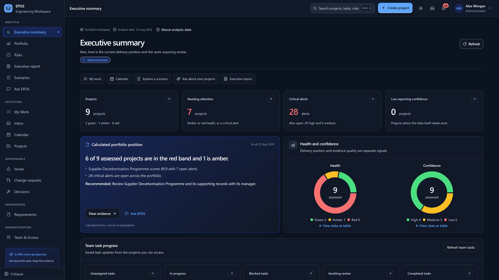
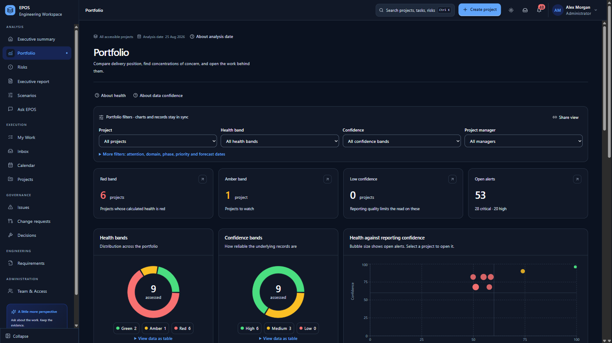
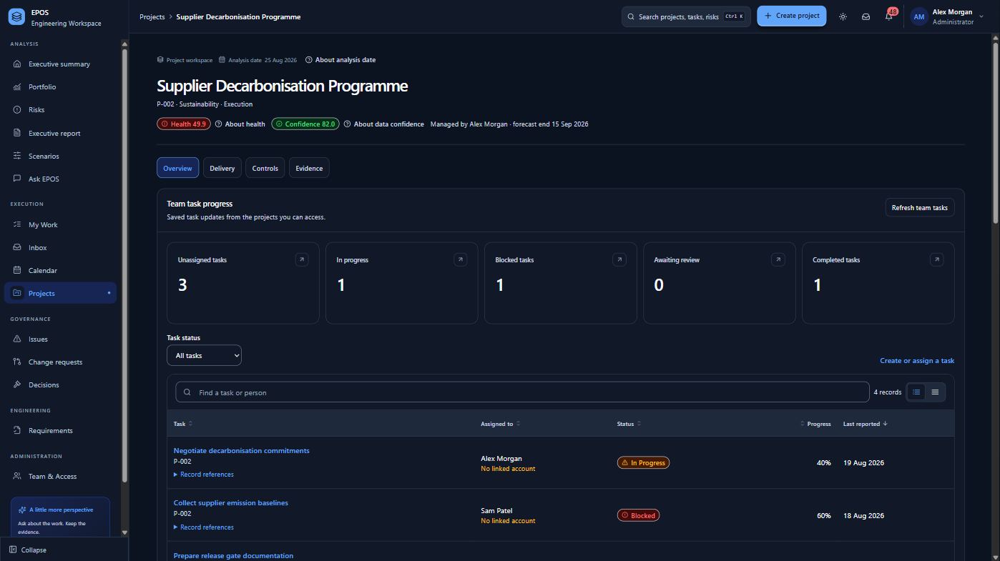
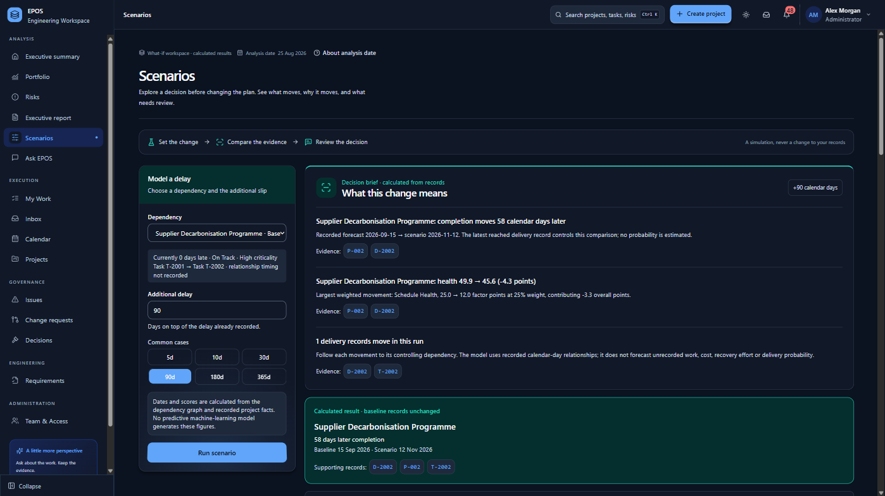
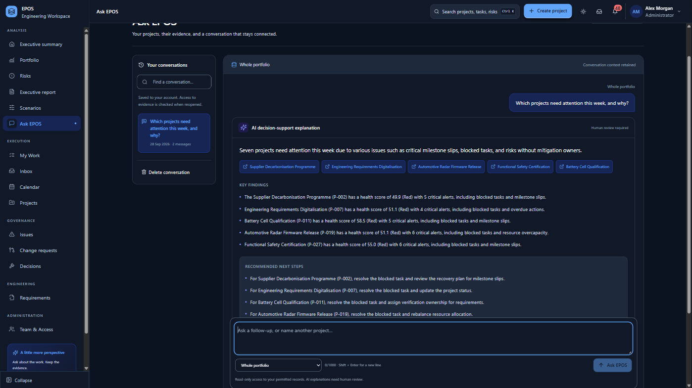
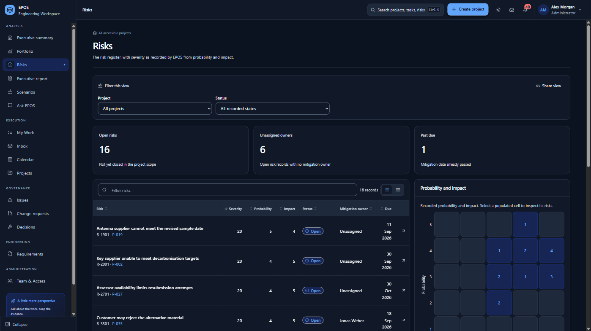
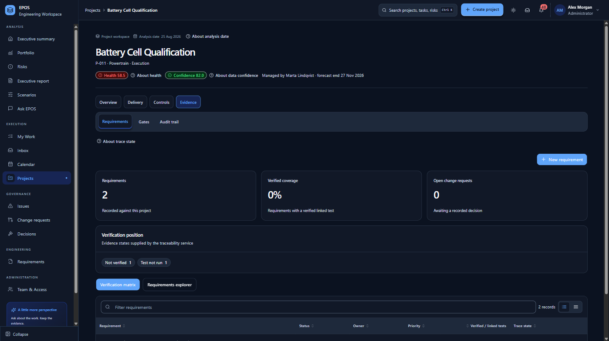
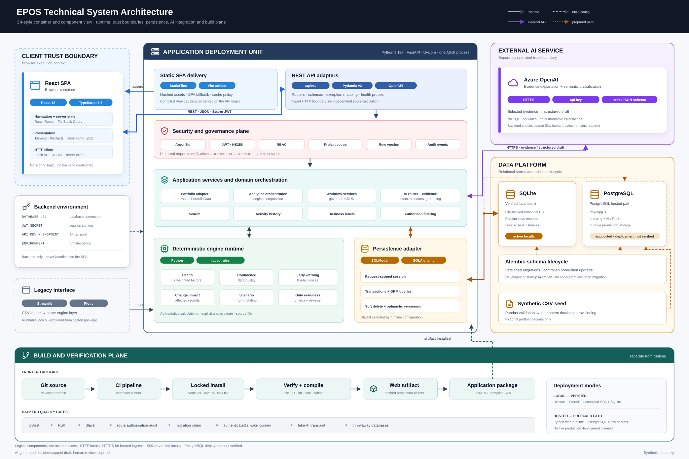
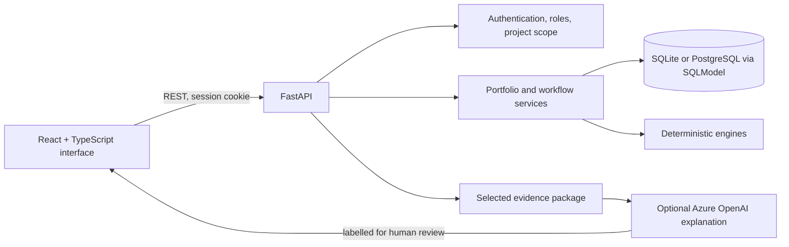

<div align="center">

# EPOS

**Engineering Portfolio Operating System**

Explainable project intelligence for engineering portfolios. Deterministic Python calculates every
number, every result cites the records behind it, and AI only explains.




<sub>Every project, person and number shown is synthetic.</sub>

</div>

## Contents

- [Why EPOS](#why-epos)
- [Highlights](#highlights)
- [Screenshots](#screenshots)
- [Architecture](#architecture)
- [Built with](#built-with)
- [Quick start](#quick-start)
- [Project structure](#project-structure)
- [Quality and testing](#quality-and-testing)
- [Documentation](#documentation)

## Why EPOS

Engineering programmes scatter their signals across schedule tools, risk registers, requirements
repositories and test management. EPOS brings a validated slice of that data into one explainable
view and answers three questions:

1. **What needs attention?** Every project gets a health score, a band and early-warning alerts.
2. **Can the answer be trusted?** A separate confidence score exposes stale, incomplete or unowned
   records instead of hiding them behind a single number.
3. **What would a change affect?** Delay and change-request scenarios show what moves and why,
   without altering a stored record.

## Highlights

- **Deterministic engines**: Health (seven weighted factors), Data Confidence (four factors), eight
  early-warning rules, change impact, and dependency-delay scenarios with a sensitivity curve.
- **Evidence behind every number**: each score, alert and answer lists the record IDs it came from.
- **Governed workflows**: tasks, risks, issues, assumptions, stage gates, change requests,
  decisions and meetings, with role permissions, optimistic concurrency and an audit trail.
- **Ask EPOS**: plain-language questions. Lookups come straight from the records; the optional AI
  only explains a validated evidence package, and its answers are labelled for human review.
- **Secure by design**: Argon2id password hashing, HttpOnly session cookies with CSRF protection,
  server-side sessions, and seven roles with project-scoped access enforced by the API.
- **Accessible, responsive interface**: light and dark themes, keyboard navigation, table views
  for charts and automated WCAG AA contrast tests.

## Screenshots

<table>
  <tr>
    <td width="50%" valign="top">
      <br>
      <b>Portfolio</b><br>
      <sub>Health and confidence bands, open alerts and a health-against-confidence chart, with filters that keep charts and records in sync.</sub>
    </td>
    <td width="50%" valign="top">
      <br>
      <b>Project workspace</b><br>
      <sub>One project end to end: health, confidence, team task progress, and delivery, controls and evidence tabs.</sub>
    </td>
  </tr>
  <tr>
    <td width="50%" valign="top">
      <br>
      <b>Scenario planning</b><br>
      <sub>A 90-day dependency slip moves completion 58 days later and health from 49.9 to 45.6, with the records behind each change.</sub>
    </td>
    <td width="50%" valign="top">
      <br>
      <b>Ask EPOS</b><br>
      <sub>A plain-language question answered with an AI explanation of the calculated evidence, citing each project and labelled for human review.</sub>
    </td>
  </tr>
  <tr>
    <td width="50%" valign="top">
      <br>
      <b>Risk register</b><br>
      <sub>Severity, mitigation owners and due dates across the portfolio, with a probability-and-impact matrix.</sub>
    </td>
    <td width="50%" valign="top">
      <br>
      <b>Requirements traceability</b><br>
      <sub>Verification coverage, trace states and the requirements explorer for each project.</sub>
    </td>
  </tr>
</table>

## Architecture





- `src/` holds every calculation, and each result lists the source record IDs behind it.
- `api/` turns stored records into engine inputs and enforces authentication, role permissions,
  project scope, row-version concurrency checks and an audit trail on every request.
- The React interface only displays what the API returns; it never recalculates a score.
- The AI receives a small, validated evidence package, never the whole dataset. Its replies are
  schema-checked, compared against that evidence and labelled for human review.

A full-page overview is in [docs/images/epos-architecture.svg](docs/images/epos-architecture.svg),
and [README-TECH.md](README-TECH.md) walks through every page, route, calculation and role.

## Built with

| Layer | Technology |
| --- | --- |
| Backend API | Python 3.11+, FastAPI, Pydantic v2, Uvicorn |
| Database | SQLModel over SQLite (PostgreSQL also supported), Alembic migrations |
| Calculation engines | Plain Python in `src/`, with Pandas for validated CSV loading |
| Security | Argon2id password hashing, short-lived signed JWTs in an HttpOnly session cookie, CSRF protection, server-side sessions, role-based access control |
| Frontend | React 18, TypeScript (strict), React Router, TanStack Query, React Hook Form with Zod |
| UI and charts | Tailwind CSS with semantic design tokens, Lucide icons, Recharts, adapted GodUI and shadcn/ui components |
| Frontend tooling | Node.js 20, npm, Vite, Vitest, Testing Library, ESLint |
| Python tooling | pytest, Ruff, Black |
| Optional AI | Azure OpenAI chat completions with structured JSON output |
| Original prototype | Streamlit and Plotly, still runnable over the same engines |

## Quick start

You need Python 3.11 or newer. Node.js 20 with npm 10 is only needed to rebuild or test the
interface, because a compiled build is already in `frontend/dist`. In Windows PowerShell:

```powershell
python -m venv .venv
.\.venv\Scripts\Activate.ps1
pip install -r requirements.txt
python -m api.seed
python -m uvicorn api.main:app --host 127.0.0.1 --port 8000
```

On macOS or Linux, activate the environment with `source .venv/bin/activate`; the other commands
are the same. For an exact replica, install `requirements-lock.txt` instead of `requirements.txt`:
it pins every package to the version the test suite passed with and needs Python 3.12 or
newer.

`python -m api.seed` creates the SQLite database `data/epos_next.db`, loads the synthetic portfolio
and creates one account per role. It prints a single generated password for all of these accounts
**once**, so copy it before closing the window. Running it again leaves existing data and accounts
unchanged.

Then open <http://127.0.0.1:8000> and sign in with any of these accounts. The interactive API
documentation is at <http://127.0.0.1:8000/docs>.

| Account | Role |
| --- | --- |
| `ceo@epos.example.com` | Executive |
| `pmo@epos.example.com` | PMO Analyst |
| `pm@epos.example.com` | Project Manager |
| `lead@epos.example.com` | Engineering Lead |
| `engineer@epos.example.com` | Engineer |
| `requirements@epos.example.com` | Requirements Manager |
| `admin@epos.example.com` | Administrator |

<details>
<summary><b>Rebuild the interface</b></summary>

`frontend/dist` is kept under version control, so a fresh clone runs without Node. To rebuild it
from source:

```powershell
cd frontend
npm ci
npm run build
```

`npm ci` installs the exact dependency versions pinned in `package-lock.json`; `npm run build`
type-checks the code and writes a new production build to `frontend/dist`. Restart the API to serve
it. Further scripts: `npm run typecheck`, `npm run lint` and `npm run test:ci`, which runs the
Vitest suite once and writes JUnit and HTML reports to `frontend/test-results`.

Always open the application through the API on port 8000. Sign-in uses same-origin session
cookies, so the Vite development server (`npm run dev`, port 5173) cannot keep you signed in.

</details>

<details>
<summary><b>Optional settings</b></summary>

Nothing needs configuring for a local run. To change a default, copy `.env.example` to `.env` and
uncomment what you need:

- `API_KEY` and `ENDPOINT` connect an Azure OpenAI chat-completions deployment for Ask EPOS and the
  AI explanations. Without them those explanations are unavailable; calculated answers, scores and
  every other feature still work.
- `EPOS_SECRET_KEY` keeps sign-ins valid across restarts. Without it a new random key is generated
  each time the API starts.
- `EPOS_DATABASE_URL` moves the database elsewhere, for example to PostgreSQL, which also needs
  `pip install "psycopg[binary]>=3.2"`.

</details>

<details>
<summary><b>The original Streamlit prototype</b></summary>

```powershell
python -m streamlit run app.py
```

It reads the CSV files in `data/` directly and analyses them as of a fixed date, 25 August 2026.

</details>

## Project structure

```text
api/              FastAPI application: routers, security, services, database access, seeding
src/              Deterministic engines: health, confidence, risk, change impact, scenarios, AI evidence
frontend/         React + TypeScript source, tests and build configuration
frontend/dist/    A ready-to-serve production build of the interface
migrations/       Alembic database migrations (configured by alembic.ini)
data/             Synthetic starter data as CSV files
tests/            Python tests for the engines, API, permissions, workflows and AI routing
scripts/          Route-permission audit, end-to-end smoke test, PostgreSQL schema generator, AI tools
app.py, pages/    The original Streamlit prototype over the same engines
docs/             Architecture, calculation methods, security, UI/UX design, user guides, screenshots
README-TECH.md    Complete technical reference: every page, route, calculation and role
requirements*.txt Python dependencies: minimum versions, and the exact versions tested
```

## Quality and testing

| Check | What it covers |
| --- | --- |
| Python tests | 1,930 passing tests over the engines, API, permissions, workflows and AI routing, using in-memory databases and fake AI connections |
| Frontend tests | 379 Vitest and Testing Library tests across 74 files, including automated contrast checks |
| Static checks | Ruff, Black, strict TypeScript and ESLint |
| Route audit | The sign-in and permission requirements of every API route |
| Smoke journey | A complete signed-in journey against a throwaway database |

The Python suite passed on Python 3.14.4, and the included interface was built with
Node.js 20.20.2.

```powershell
$env:PYTHON_DOTENV_DISABLED = '1'
python -m pytest
python -m ruff check .
python -m black --check .
python scripts/audit_route_auth.py
python scripts/smoke_journey.py
```

The Python tests need no network access or API key and never touch `data/epos_next.db`. Frontend
tests run with `npm run test:ci` in `frontend/`.

## Documentation

| Topic | Documents |
| --- | --- |
| Technical overview | [README-TECH.md](README-TECH.md) |
| Architecture | [docs/epos-next-architecture.md](docs/epos-next-architecture.md), [docs/architecture.md](docs/architecture.md), [docs/images/epos-architecture.svg](docs/images/epos-architecture.svg), [docs/images/epos-technical-architecture.svg](docs/images/epos-technical-architecture.svg) |
| Calculations | [docs/scoring-methodology.md](docs/scoring-methodology.md), [docs/change-impact-methodology.md](docs/change-impact-methodology.md), [docs/scenario-methodology.md](docs/scenario-methodology.md), [docs/gate-readiness-methodology.md](docs/gate-readiness-methodology.md), [docs/phase3-summary.md](docs/phase3-summary.md) |
| AI | [docs/ai-governance.md](docs/ai-governance.md) |
| Data and security | [docs/data-dictionary.md](docs/data-dictionary.md), [docs/epos-next-security.md](docs/epos-next-security.md), [docs/access-by-role.md](docs/access-by-role.md) |
| UI and UX | [docs/ui-design-guide.md](docs/ui-design-guide.md), [docs/epos-next-design-system.md](docs/epos-next-design-system.md), [docs/user-guide.md](docs/user-guide.md), [docs/user-personas.md](docs/user-personas.md) |
| Requirements and testing | [docs/problem-statement.md](docs/problem-statement.md), [docs/functional-requirements.md](docs/functional-requirements.md), [docs/non-functional-requirements.md](docs/non-functional-requirements.md), [docs/test-scenarios.md](docs/test-scenarios.md), [docs/roadmap.md](docs/roadmap.md) |
| Running locally | [docs/epos-next-local-guide.md](docs/epos-next-local-guide.md) |

## Notices

Some interface components are adapted from GodUI and shadcn/ui under the MIT License. Their notices
are in `frontend/src/components/godui/LICENSE.txt` and `frontend/src/components/shadcn/LICENSE.txt`.
All project, person and company data in this repository is synthetic.

<sub>AI-generated decision-support draft; human review required.</sub>
